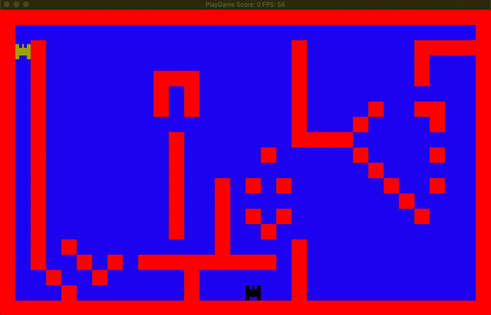

# CPPND: Capstone Project

This is my Capstone Project for the [Udacity C++ Nanodegree Program](https://www.udacity.com/course/c-plus-plus-nanodegree--nd213). The starter code was provided by Udacity.  



This project integrates many of the C++ concepts taught throughout the program. It's a showcase of my ability to independently build applications using modern C++.

I extended the [Snake Game](https://github.com/udacity/CppND-Capstone-Snake-Game), applying good software design and engineering principles.

## 🚀 Cross-Platform Build System

This project features a robust cross-platform build system supporting **Windows**, **macOS**, and **Linux** with automatic dependency detection and platform-specific optimizations.

### 📋 Prerequisites

#### All Platforms
- **CMake** ≥ 3.21  
  - Download: https://cmake.org/install/
  - macOS: `brew install cmake`
  - Ubuntu/Debian: `sudo apt install cmake`
  - Windows: Download installer or use `winget install Kitware.CMake`

- **SDL3** Development Libraries
  - macOS: `brew install sdl3`
  - Ubuntu/Debian: `sudo apt install libsdl3-dev`
  - Fedora/CentOS: `sudo dnf install SDL3-devel`
  - Arch Linux: `sudo pacman -S sdl3`
  - Windows: Download from https://github.com/libsdl-org/SDL/releases

#### Windows Specific
- **Visual Studio 2019/2022** (recommended) or **MinGW-w64**
  - VS Community: https://visualstudio.microsoft.com/vs/community/
  - MinGW via MSYS2: https://www.msys2.org/

#### macOS Specific  
- **Xcode Command Line Tools**
  - Install: `xcode-select --install`
  - Full Xcode (optional): Available from App Store

#### Linux Specific
- **Build Tools**
  - Ubuntu/Debian: `sudo apt install build-essential`
  - Fedora/CentOS: `sudo dnf install gcc-c++ make`
  - Arch Linux: `sudo pacman -S base-devel`

## 🔧 Quick Build Instructions  

### Using Platform Scripts (Recommended)

#### Windows
```batch
# Simple build (Release mode)
build.bat

# Debug build with clean
build.bat --debug --clean

# Specify SDL3 location
build.bat --sdl3-path "C:\SDL3"

# Use specific generator
build.bat --vs2022 --install
```

#### Linux/macOS
```bash
# Simple build (Release mode)
./build.sh

# Debug build with clean
./build.sh --debug --clean

# Use Ninja build system
./build.sh --ninja --install

# macOS with Xcode
./build.sh --xcode
```

### Manual Build Process

1. **Clone and Setup**
   ```bash
   git clone <repository-url>
   cd CppND-Capstone-Project
   mkdir build && cd build
   ```

2. **Configure**
   ```bash
   # Basic configuration
   cmake ..
   
   # With custom SDL3 path
   cmake -DSDL3_PATH="/path/to/SDL3" ..
   
   # Specify build type
   cmake -DCMAKE_BUILD_TYPE=Release ..
   ```

3. **Build**
   ```bash
   # Build with system default
   cmake --build .
   
   # Build with specific config (Windows)
   cmake --build . --config Release
   
   # Parallel build
   cmake --build . --parallel 4
   ```

4. **Run**
   ```bash
   # Linux/macOS
   ./bin/PlayGame
   
   # Windows
   bin\Release\PlayGame.exe
   ```

## 🎮 Running the Game

After building, the executable will be located in:
- **Linux/macOS**: `build/bin/PlayGame`
- **Windows**: `build/bin/Release/PlayGame.exe` (or Debug)
- **macOS Bundle**: `build/bin/Release/PlayGame.app` (with Xcode)

### Controls
- Use arrow keys or WASD to control the player
- Avoid enemies and obstacles
- Collect items to increase your score

## 🛠️ Build System Features

### Platform Detection
- Automatic compiler and platform detection
- Platform-specific compiler flags and optimizations
- Proper library linking for Windows, macOS, and Linux

### Build Configurations
- **Debug**: Full debugging information, no optimization
- **Release**: Optimized for performance with debug symbols
- **RelWithDebInfo**: Optimized with debug information  
- **MinSizeRel**: Optimized for minimal size

### Generator Support
- **Windows**: Visual Studio 2019/2022, MinGW, Ninja, NMake
- **macOS**: Xcode, Unix Makefiles, Ninja
- **Linux**: Unix Makefiles, Ninja

### Advanced Options

#### Custom SDL3 Installation
```bash
# CMake variable
cmake -DSDL3_PATH="/custom/path/to/SDL3" ..

# Environment variable  
export SDL3_PATH="/custom/path/to/SDL3"
cmake ..
```

#### Cross-Compilation
The build system supports cross-compilation:
```bash
# Windows to Linux (with appropriate toolchain)
cmake -DCMAKE_TOOLCHAIN_FILE=linux-toolchain.cmake ..

# macOS Universal Binary
cmake -DCMAKE_OSX_ARCHITECTURES="x86_64;arm64" ..
```

## 📁 Project Structure

```
CppND-Capstone-Project/
├── src/                    # Source code
├── cmake/                  # CMake modules
│   ├── FindSDL3.cmake     # SDL3 detection
│   ├── FindSDL3_image.cmake
│   └── MacOSXBundleInfo.plist.in
├── build.bat               # Windows build script
├── build.sh                # Unix/Linux/macOS build script
├── CMakeLists.txt          # Main CMake configuration
└── README.md               # This file
```

## ⚙️ Build Script Options

### Windows (`build.bat`)
- `--debug` / `--release`: Build configuration
- `--clean`: Clean build directory
- `--install`: Install after build
- `--vs2022` / `--vs2019`: Visual Studio generator
- `--mingw`: MinGW Makefiles
- `--ninja`: Ninja generator
- `--sdl3-path PATH`: Custom SDL3 location

### Unix/Linux/macOS (`build.sh`)
- `--debug` / `--release`: Build configuration  
- `--clean`: Clean build directory
- `--install`: Install after build
- `--make`: Unix Makefiles generator
- `--ninja`: Ninja generator
- `--xcode`: Xcode generator (macOS only)
- `--sdl3-path PATH`: Custom SDL3 location
- `--jobs N`: Parallel build jobs

## 🐛 Troubleshooting

### SDL3 Not Found
- **Windows**: Download SDL3 development libraries and use `--sdl3-path`
- **macOS**: `brew install sdl3`
- **Linux**: Install SDL3 development package for your distribution

### Build Fails on Windows
- Ensure you have Visual Studio 2019+ or MinGW-w64 installed
- Try using the `--vs2022` or `--mingw` options explicitly
- Check that SDL3 libraries match your architecture (x64/x86)

### Build Fails on Linux
- Install build tools: `sudo apt install build-essential cmake`
- Install SDL3: `sudo apt install libsdl3-dev`
- For other distributions, use equivalent packages

### macOS Build Issues
- Install Xcode Command Line Tools: `xcode-select --install`
- Install SDL3: `brew install sdl3`
- For older macOS versions, you may need to adjust `CMAKE_OSX_DEPLOYMENT_TARGET`

## 📝 Development Notes

- The project uses C++17 standard
- Code formatting is configured with `.clang-format`
- Editor settings are defined in `.editorconfig`
- Cross-platform compatibility is maintained throughout

## 🤝 Contributing

When contributing, please ensure your changes work on all supported platforms:
1. Test builds on Windows, macOS, and Linux when possible
2. Follow the existing code style (use `clang-format`)
3. Update build scripts if adding new dependencies
4. Update this README if changing build requirements

## 📄 License

This project is part of the Udacity C++ Nanodegree Program.
