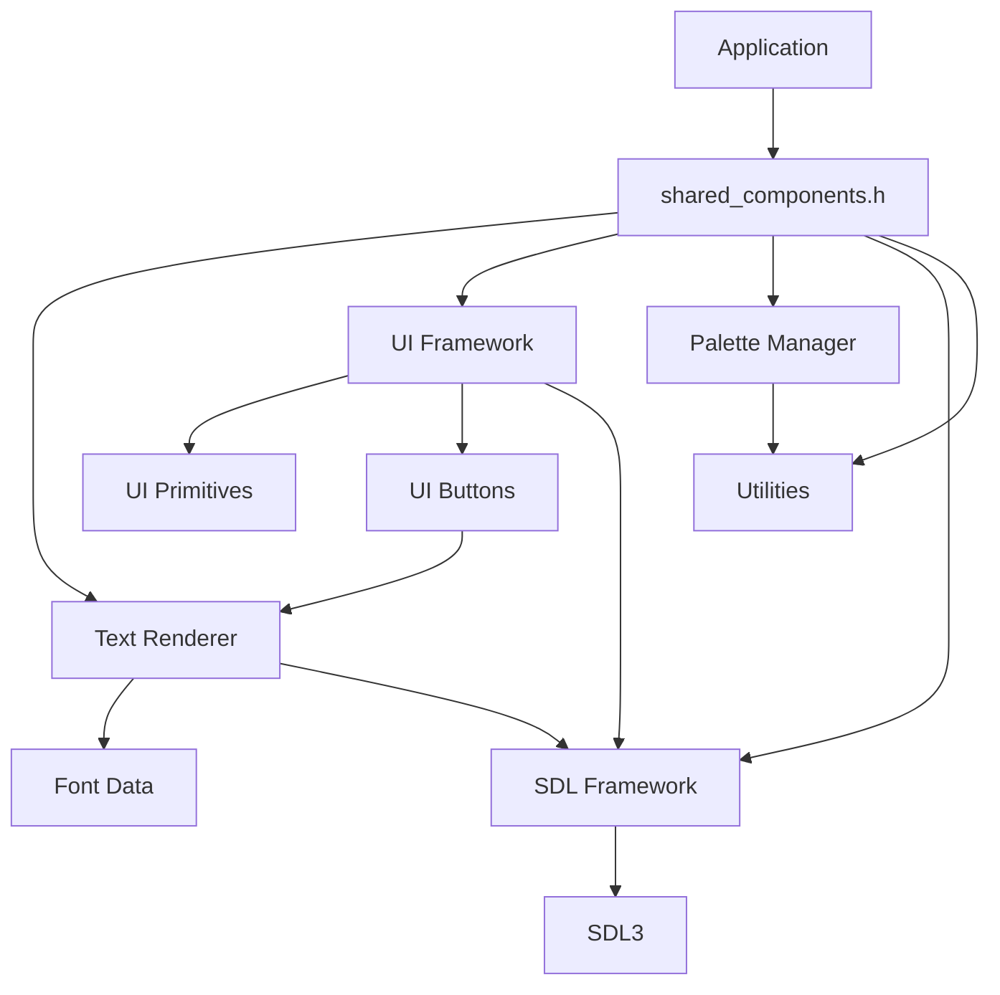

# Architecture Documentation - Shared Components Library

Technical architecture and design decisions for the shared components library.

## Table of Contents

- [Overview](#overview)
- [Design Principles](#design-principles)
- [Component Architecture](#component-architecture)
- [System Integration](#system-integration)
- [Performance Considerations](#performance-considerations)
- [Memory Management](#memory-management)
- [Extension Points](#extension-points)
- [Future Development](#future-development)

---

## Overview

The shared components library extracts common functionality from palette-maker and tile-maker applications into a reusable, modular architecture. The design emphasizes performance, maintainability, and ease of integration while preserving the original applications' behavior.

### Architecture Goals

1. **Code Reuse**: Eliminate 65% of duplicate UI code across applications
2. **Performance**: Maintain or improve rendering performance
3. **Maintainability**: Centralize bug fixes and feature improvements
4. **Extensibility**: Support future applications and components
5. **Simplicity**: Provide clean, intuitive APIs

### Key Architectural Decisions

| Decision | Rationale | Trade-offs |
|----------|-----------|------------|
| C11 Language | Compatibility with existing codebase | Limited object-oriented features |
| Static Library | Deployment simplicity | Larger executable size |
| Header-only APIs | Compile-time optimization | Increased compilation time |
| Struct-based OOP | Object-oriented design in C | Manual memory management |
| SDL3 Dependency | Mature graphics framework | Platform-specific dependency |

---

## Design Principles

### 1. Separation of Concerns

Each component has a single, well-defined responsibility:

```
Text Renderer    → Font rendering and text display
UI Framework     → Interactive elements and primitives  
Palette Manager  → Color management and file I/O
SDL Framework    → System integration and context management
Utilities        → Common functionality and helpers
```

### 2. Dependency Inversion

High-level components depend on abstractions, not concrete implementations:

```c
// TextRenderer depends on SDL_Renderer interface, not specific implementation
typedef struct {
    SDL_Renderer* renderer;  // Abstract interface
    bool initialized;
    SDL_Color default_color;
} TextRenderer;
```

### 3. Interface Segregation

Components expose only necessary functionality:

```c
// Public API - Only essential functions exposed
bool text_renderer_init(TextRenderer* tr, SDL_Renderer* renderer);
void text_render_string(TextRenderer* tr, const char* text, int x, int y, SDL_Color color);

// Private implementation details hidden in .c file
static const uint8_t* get_glyph_data(int char_index);
static void render_glyph_pixel(SDL_Renderer* renderer, int x, int y, SDL_Color color);
```

### 4. Composition Over Inheritance

Components are composed rather than inherited:

```c
// Application composes components as needed
typedef struct {
    SDLContext sdl_ctx;
    TextRenderer text_renderer;
    PaletteManager palette;
    UIButtonArray buttons;
} Application;
```

---

## Component Architecture

### Core Component Hierarchy

```
shared_components.h (Main Library Interface)
├── Text Rendering System
│   ├── font_data.h/c          (5x7 Bitmap Font Data)
│   └── text_renderer.h/c      (Text & 7-Segment Rendering)
├── UI Framework
│   ├── ui_primitives.h/c      (Basic Drawing Functions)
│   └── ui_button.h/c          (Interactive Button System)
├── Palette Manager
│   └── palette_manager.h/c    (16-Color RGBA Management)
├── SDL Framework
│   └── sdl_context.h/c        (SDL3 Integration Layer)
└── Utilities
    ├── double_click.h/c       (Double-Click Detection)
    └── file_utils.h/c         (File System Operations)
```

### Component Relationships



### Data Flow Architecture

```
User Input → SDL Events → UI Framework → Callbacks → Application Logic
                                     ↓
Application State → Palette Manager → Rendering Data → Text Renderer → SDL3
```

---

## System Integration

### Initialization Sequence

```c
// 1. Library initialization
shared_components_init()
├── font_validate_data()        // Validate font integrity
└── global_state_init()         // Initialize library state

// 2. Component initialization (order matters)
sdl_init_context()              // SDL3 context first
├── SDL_Init()
├── SDL_CreateWindow()
└── SDL_CreateRenderer()

text_renderer_init()            // Text renderer needs SDL renderer
├── validate_renderer()
└── set_default_state()

palette_manager_init()          // Palette manager independent
├── load_default_palette()
└── reset_modification_flags()

ui_button_array_init()          // UI components last
└── allocate_button_storage()
```

### Cleanup Sequence

```c
// Reverse order of initialization
ui_button_array_cleanup()       // UI components first
text_renderer_cleanup()         // Text renderer
sdl_cleanup_context()           // SDL context
shared_components_cleanup()     // Library cleanup last
```

### Error Handling Strategy

```c
// Defensive programming approach
bool component_init(Component* comp, Args* args) {
    // 1. Validate inputs
    if (!comp || !args) {
        return false;
    }
    
    // 2. Initialize with defaults
    memset(comp, 0, sizeof(Component));
    
    // 3. Attempt initialization
    if (!internal_init(comp, args)) {
        // 4. Cleanup on failure
        internal_cleanup(comp);
        return false;
    }
    
    // 5. Mark as initialized
    comp->initialized = true;
    return true;
}
```

---

## Performance Considerations

### Text Rendering Optimization

#### Font Data Structure

```c
// Optimized for cache locality
static const uint8_t font_5x7[GLYPH_COUNT][FONT_HEIGHT] = {
    // Glyph data stored sequentially for better cache performance
    {0x00, 0x00, 0x00, 0x00, 0x00, 0x00, 0x00}, // Space
    {0x04, 0x04, 0x04, 0x04, 0x00, 0x04, 0x00}, // !
    // ... more glyphs
};
```

#### Character Mapping Optimization

```c
// Fast character index lookup using switch statement
// Compiler optimizes to jump table for performance
int font_get_char_index(char c) {
    switch (c) {
        case ' ': return 0;
        case '!': return 1;
        // ... optimized cases
        default: return 0; // Unknown chars render as space
    }
}
```

### UI Framework Performance

#### Button Hit Testing

```c
// Optimized point-in-rectangle test
static inline bool point_in_rect_fast(int x, int y, const SDL_FRect* rect) {
    return (x >= rect->x && x < rect->x + rect->w && 
            y >= rect->y && y < rect->y + rect->h);
}
```

#### Batch Rendering

```c
// Minimize SDL state changes
void ui_button_array_render(UIButtonArray* array, SDL_Renderer* renderer, 
                           TextRenderer* text_renderer) {
    // Set render state once
    SDL_SetRenderDrawBlendMode(renderer, SDL_BLENDMODE_BLEND);
    
    // Render all buttons without state changes
    for (int i = 0; i < array->count; i++) {
        ui_button_render_internal(&array->buttons[i], renderer, text_renderer);
    }
}
```

### Memory Access Patterns

#### Palette Manager Optimization

```c
// Structure layout optimized for cache lines
typedef struct {
    RGBA colors[16];              // 64 bytes - single cache line
    bool modified;                // Hot data together
    bool file_loaded;
    char current_file[256];       // Cold data separate
} PaletteManager;
```

#### SDL Context Optimization

```c
// Frequently accessed data at beginning of structure
typedef struct {
    SDL_Renderer* renderer;       // Most frequently accessed
    SDL_Window* window;
    int width, height;            // Frequently accessed
    char title[128];              // Less frequently accessed
    bool initialized;
    bool vsync_enabled;
} SDLContext;
```

---

## Memory Management

### Allocation Strategy

The library uses a mixed allocation approach:

1. **Stack Allocation**: For component structures (user-managed)
2. **Dynamic Allocation**: For arrays and variable-size data
3. **Static Allocation**: For constant data (font patterns)

```c
// Example allocation patterns
TextRenderer tr;                    // Stack allocation (user manages)
UIButtonArray buttons;              // Stack allocation
ui_button_array_init(&buttons, 10); // Dynamic allocation for button storage
```

### Memory Ownership Model

```c
// Clear ownership rules
// 1. Caller owns component structures
TextRenderer text_renderer;  // Caller-owned

// 2. Library owns internal allocations
UIButtonArray buttons;       // Structure caller-owned
ui_button_array_init(&buttons, 10); // Internal array library-owned

// 3. Explicit cleanup required
ui_button_array_cleanup(&buttons);  // Frees internal allocations
```

### Memory Safety Features

```c
// Bounds checking
RGBA palette_get_color(const PaletteManager* pm, int index) {
    if (!pm || index < 0 || index >= PALETTE_COLOR_COUNT) {
        return (RGBA){0, 0, 0, 0}; // Safe default
    }
    return pm->colors[index];
}

// Null pointer protection
void text_render_string(TextRenderer* tr, const char* text, int x, int y, SDL_Color color) {
    if (!tr || !tr->initialized || !text) {
        return; // Safe no-op
    }
    // ... rendering logic
}
```

---

## Extension Points

### Adding New Components

The architecture supports new components through standardized patterns:

```c
// 1. Create component header (my_component.h)
#ifndef MY_COMPONENT_H
#define MY_COMPONENT_H

#include <SDL3/SDL.h>
#include <stdbool.h>

typedef struct {
    // Component state
    bool initialized;
    // ... component-specific data
} MyComponent;

bool my_component_init(MyComponent* comp, InitArgs* args);
void my_component_cleanup(MyComponent* comp);
bool my_component_is_ready(const MyComponent* comp);

#endif

// 2. Add to main header (shared_components.h)
#include "my_component/my_component.h"

// 3. Add to CMakeLists.txt
add_library(shared_components STATIC
    # ... existing files
    my_component/my_component.c
)
```

### Extending Text Renderer

Support for new font formats:

```c
// Extension interface
typedef struct {
    const char* name;
    int width, height;
    int char_count;
    const uint8_t* (*get_glyph)(int char_index);
    int (*get_char_index)(char c);
} FontProvider;

// Register custom font
bool text_renderer_register_font(TextRenderer* tr, const FontProvider* provider);
bool text_renderer_select_font(TextRenderer* tr, const char* font_name);
```

### Extending UI Framework

Custom UI components:

```c
// Base UI component interface
typedef struct {
    SDL_FRect rect;
    bool visible;
    bool (*handle_input)(void* self, int mx, int my, bool clicked);
    void (*render)(void* self, SDL_Renderer* renderer);
} UIComponent;

// Custom component example
typedef struct {
    UIComponent base;
    // Custom component data
} MyCustomComponent;
```

### Extending Palette Manager

Support for different palette formats:

```c
// Palette format interface
typedef struct {
    const char* extension;
    bool (*load)(PaletteManager* pm, const char* filename);
    bool (*save)(const PaletteManager* pm, const char* filename);
    bool (*validate)(const char* filename);
} PaletteFormat;

// Register format
bool palette_manager_register_format(const PaletteFormat* format);
```

---

## Future Development

### Planned Enhancements

#### 1. Enhanced Text Rendering

```c
// Multi-font support
typedef enum {
    FONT_5X7_BITMAP,
    FONT_7_SEGMENT,
    FONT_CUSTOM
} FontType;

bool text_renderer_set_font(TextRenderer* tr, FontType type);

// Text formatting
typedef struct {
    SDL_Color color;
    bool bold;
    bool italic;
    int scale;
} TextStyle;

void text_render_styled(TextRenderer* tr, const char* text, int x, int y, 
                       const TextStyle* style);
```

#### 2. Advanced UI Components

```c
// Slider component
typedef struct {
    UIComponent base;
    float value;
    float min_value, max_value;
    void (*on_change)(float value, void* userdata);
} UISlider;

// Text input component
typedef struct {
    UIComponent base;
    char text[256];
    int cursor_pos;
    bool focused;
} UITextInput;
```

#### 3. Animation System

```c
// Animation framework
typedef struct {
    float start_time;
    float duration;
    void (*update)(float progress, void* target);
    void* target;
} Animation;

bool animation_system_init(void);
void animation_add(const Animation* anim);
void animation_update(float current_time);
```

### Architectural Evolution

#### Phase 1: Core Stability (Current)
- ✅ Basic component extraction
- ✅ API stabilization
- ✅ Performance optimization
- ✅ Documentation completion

#### Phase 2: Enhanced Features (Next 6 months)
- [ ] Multi-font support
- [ ] Advanced UI components
- [ ] Animation system
- [ ] Audio integration helpers

#### Phase 3: Advanced Capabilities (12+ months)
- [ ] 3D rendering support
- [ ] Network utilities
- [ ] Scripting integration
- [ ] Plugin architecture

### Backward Compatibility Strategy

```c
// Version macros for compatibility
#define SHARED_COMPONENTS_VERSION_MAJOR 1
#define SHARED_COMPONENTS_VERSION_MINOR 0
#define SHARED_COMPONENTS_VERSION_PATCH 0

// API versioning
#if SHARED_COMPONENTS_VERSION_MAJOR >= 2
    // New API available
    text_renderer_set_font(tr, FONT_7_SEGMENT);
#else
    // Fallback to v1 API
    text_render_7segment_string(tr, "1234", x, y, color, scale);
#endif
```

### Extension Architecture

```c
// Plugin interface for future extensions
typedef struct {
    const char* name;
    int version;
    bool (*init)(void);
    void (*cleanup)(void);
    void* (*get_interface)(const char* interface_name);
} SharedComponentsPlugin;

// Plugin registration
bool shared_components_register_plugin(const SharedComponentsPlugin* plugin);
void* shared_components_get_plugin_interface(const char* plugin_name, 
                                           const char* interface_name);
```

---

## Design Patterns

### Factory Pattern

```c
// Component creation through factory functions
SDLContext* sdl_create_context(const SDLContextConfig* config);
TextRenderer* text_create_renderer(SDL_Renderer* renderer);
UIButton* ui_create_button(int x, int y, int w, int h, const char* text);
```

### Observer Pattern

```c
// Event system for component communication
typedef void (*ComponentEventCallback)(ComponentEvent* event, void* userdata);

bool component_subscribe_event(ComponentEventType type, 
                              ComponentEventCallback callback, 
                              void* userdata);
void component_publish_event(const ComponentEvent* event);
```

### Strategy Pattern

```c
// Rendering strategy selection
typedef struct {
    void (*render_text)(const char* text, int x, int y, SDL_Color color);
    void (*render_glyph)(char c, int x, int y, SDL_Color color);
} RenderStrategy;

void text_renderer_set_strategy(TextRenderer* tr, const RenderStrategy* strategy);
```

---

## Conclusion

The shared components library architecture provides a solid foundation for code reuse while maintaining performance and extensibility. The modular design allows components to evolve independently while preserving backward compatibility.

Key architectural strengths:
- **Modularity**: Components can be used independently
- **Performance**: Optimized for common use cases
- **Extensibility**: Clear extension points for future development
- **Maintainability**: Clean separation of concerns
- **Simplicity**: Intuitive APIs reduce integration complexity

The architecture successfully achieves the goal of eliminating code duplication while providing a foundation for future application development.

---

*This architecture documentation provides the technical foundation for understanding and extending the shared components library.*
